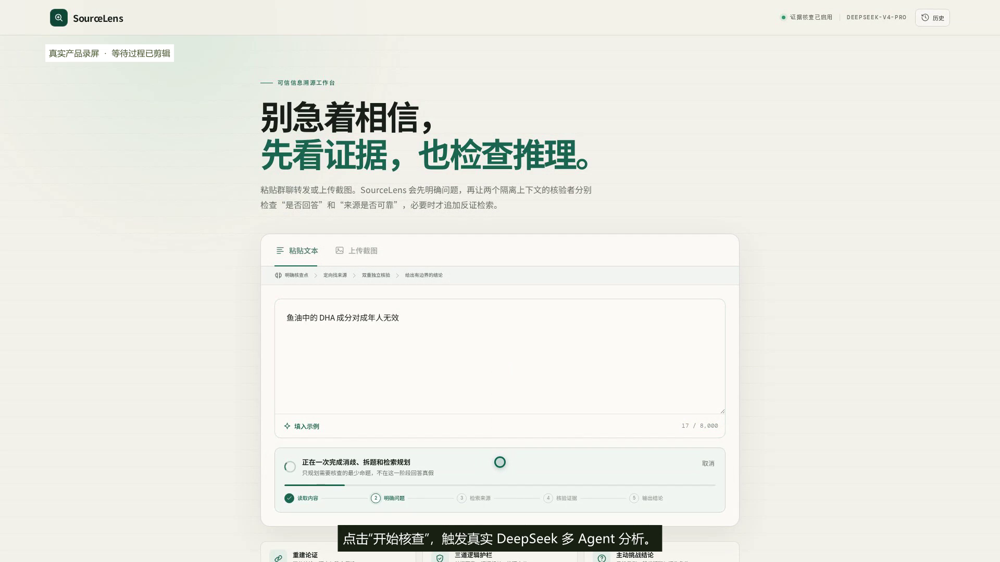
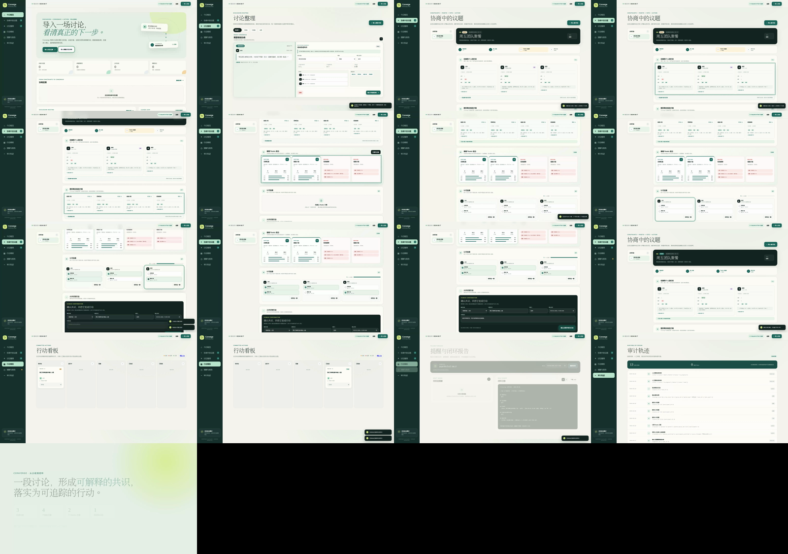

# Agent Product Lab

<div align="center">

**面向真实任务、可信证据与安全执行的 AI Agent 产品实验室**

从产品定义、工作流设计和全栈原型，到评测、人工审批与可审计交付。

[](#项目地图)
[](#已实现项目)
[](#共同设计原则)
[](#共同设计原则)

</div>

---

这个仓库记录我对 Agent 产品化的实践：不止让模型“给出回答”，还要让系统能够处理不确定性、引用真实证据、控制高风险动作，并用可复现的评测说明它是否真的有效。

## 项目地图

| 项目 | 状态 | 核心问题 | 代表能力 |
| --- | --- | --- | --- |
| [SourceLens](./source-lens/) | **可运行 MVP** | 如何把截图、转发与短视频中的主张变成可核验结论？ | 多模态输入、可信 RAG、证据溯源、多 Agent 核验 |
| [Converge](./action-trace/) | **可运行 MVP** | 如何把群聊中的分歧与承诺变成可审计的共识和行动？ | 讨论分流、约束决策、HITL、行动追踪、固定评测 |

## 已实现项目

### SourceLens · 可信信息核验 Agent

<p align="center">
  
</p>

SourceLens 对文本、截图和字幕进行主张拆解，规划检索并读取真实网页，再由隔离上下文的 Evidence Matching 与 Source Quality Agent 分别判断证据匹配度和来源质量。最终报告保留证据 ID、来源链接、分歧和置信边界。

```text
多模态输入 → 主张拆解 → 检索规划 → 真实来源读取
          → 证据匹配 ┐
                     ├→ 最终裁决 → 可点击证据报告
          → 来源审查 ┘
```

- React + TypeScript + Express
- DeepSeek 多角色协作与确定性降级
- PubMed、OpenAlex 与网页证据路线
- SSE 实时进度、引用白名单、Prompt Injection 防护

查看 [完整说明](./source-lens/README.md) · [产品规格](./source-lens/PROJECT.md) · [演示材料](./source-lens/demo/)

### Converge · 群体决策与行动闭环 Agent

<p align="center">
  
</p>

Converge 从群聊或会议记录判断讨论处于“仍需形成共识”还是“已经形成行动”，经人工核对后进入约束协商或任务确认，最终形成从原文证据到状态跟踪的审计链路。

```text
讨论记录 → 阶段识别 ┬→ 约束校验 → Pareto 候选 → 主持人确认 ┐
                    └→ 行动抽取 → 人工审批 ───────────────┤
                                                        ↓
                                             任务、提醒、报告与审计
```

- Python 零依赖服务端 + 本地 SQLite
- 规则 Baseline 与 DeepSeek 抽取器可对比
- 私密预算、硬约束、认可投票与 Pareto 前沿
- 52 条合成回归样例；明确区分开发集结果与生产指标

查看 [完整说明](./action-trace/README.md) · [产品规格](./action-trace/PROJECT.md) · [评测口径](./action-trace/evals/README.md)

## 共同设计原则

1. **Evidence over eloquence**：模型表达不能代替真实来源、原文位置和可复核证据。
2. **Evaluation before demo**：每个 MVP 都需要 Baseline、固定样例、失败分类和可复现结果。
3. **Human authority**：退款、预算、发送消息和正式任务等高风险动作必须由人确认。
4. **Graceful degradation**：模型不可用或输出无效时，系统应安全失败或回退，而不是伪造成功。
5. **Honest metrics**：合成开发集、离线测试和真人实验严格区分；未验证指标明确标为目标。

## 快速开始

```bash
git clone https://github.com/CHANGJianshuo/agent-product-lab.git
cd agent-product-lab
```

运行 SourceLens：

```bash
cd source-lens
npm install
cp .env.example .env.local
npm run dev
```

运行 Converge（无需 API Key）：

```bash
cd action-trace
python3 server.py
```

更完整的环境变量、测试方式和边界说明请阅读各项目 README。任何真实 API Key 都只能保存在本地环境变量或被忽略的 `.env.local` 中。

## 使用开发 Agent

每个项目的 `PROJECT.md` 是产品目标与验收边界的事实源。将 [AGENT_PROMPT.md](./AGENT_PROMPT.md) 提供给开发 Agent，并替换其中的 `<PROJECT_DIR>`；Agent 必须先读规格，再检查代码、规划、开发和验证。

## Roadmap

- [x] SourceLens：可信检索、隔离核验与证据报告
- [x] Converge：讨论分流、群体决策、行动追踪与离线评测
- [ ] 引入独立 holdout 与真实用户任务评测

## 说明

这是个人产品与工程研究项目，不代表腾讯或任何相关公司的官方产品。仓库中的示例和评测数据为合成或公开材料；请勿把本项目输出直接作为医疗、法律、投资或其他高风险决策依据。
